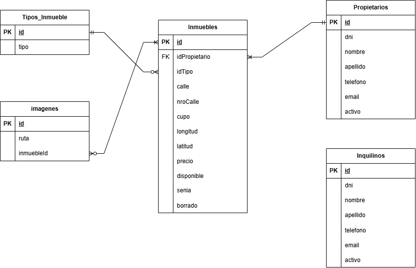

# inmobiliaria2026

> Proyecto Inmobiliaria para la materia Laboratorio II.

---

## 👥 Integrantes del Grupo

* **Manuel Gutierrez** - [@Manug95](https://github.com/Manug95)

---

## 📐 Modelado de Datos

A continuación se presenta el esquema del modelo de datos correspondiente a la aplicación:

### Diagrama Entidad-Relación (DER) / Diagrama de Clases

El archivo "dbinmobiliaria.sql" contiene la creación de la BD en MySql 8.0.43 y la creación de las tablas necesarias para la aplicación.